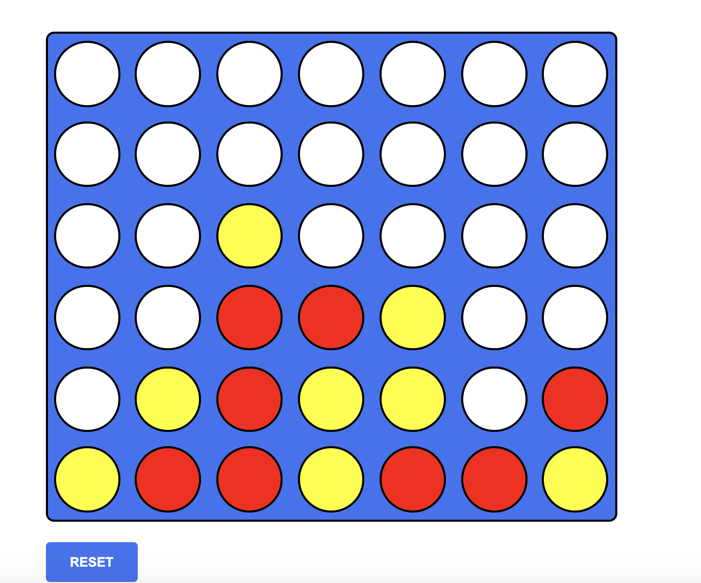

# Connect the Four
  - This is a game named Connect the Four using HTML, CSS & Vanilla Javascript.
# How to Play
  - There would be two users: red and yellow
  - To win, one has to connect four of your colored checker pieces in a row horizontally, vertically or diagonally. 
# Screenshot
